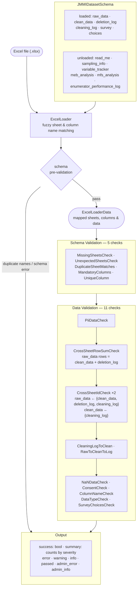

# Prototype for validation of RQA datasets
**Aim**: To develop a hopefully flexible framework that can perform validations on different datasets with non-standard sheet and column names that have different validation rules.

## Suported Datasets

- jmmi datasets
- other datasets through dynamic schema generation - see below.

## JMMI Validation Flow



## Project structure
This project is designed to allow for the validation of different excel based datasets through the construction of a dataset schema and specifying a list of validation rules that are required to be run.

For standardised datasets, a schema can be specified in **models**. Each of the dataset model classes also lists what validation rules (and their required paramaters) are to be run for the dataset. This folder also includes a dynamic schema generator for datasets that are not yet standardised in **dynamic_model.py**. 

Only excel files are currently supported. **loaders**: handles the loading of excel files and some of the sheet and column matching to the schema.

The individual validation rules are specified in **validators**. These are modular and can be run for any dataset as long as the relevant paramters are set. The **helpers** files contain commonly used functions for getting the required sheets and columns from the schema or data. 

**orchestrator** runs all the steps of the validation process. If integrating this into other projects then using the `run_all` function in the `ValidationPipeline` class would be recommended.

**locales** contains translation files for validation messages. See [translations](locales/translations.md) for contributing to this.

```bash
├── dataset_requirements.md
├── Dockerfile
├── .dockerignore
├── .github
│   └── workflows
│       ├── pytest.yml
│       └── ruff.yml
├── .gitignore
├── locales
│   ├── en
│   ├── fr
│   └── translations.md
├── main.py
├── pyproject.toml
├── .python-version
├── README.md
├── src
│   ├── rqa_validator
│   │   ├── common
│   │   │   ├── expression_builder.py
│   │   │   ├── list_matching.py
│   │   │   └── schema_matching.py
│   │   ├── config.py
│   │   ├── __init__.py
│   │   ├── loaders
│   │   │   ├── base_excel_loader.py
│   │   │   ├── base.py
│   │   │   ├── excel_loader.py
│   │   │   └── __init__.py
│   │   ├── models
│   │   │   ├── base_dataset.py
│   │   │   ├── base.py
│   │   │   ├── dynamic_model.py
│   │   │   ├── __init__.py
│   │   │   ├── jmmi.py
│   │   │   └── preprocess.py
│   │   ├── orchestrator
│   │   │   ├── __init__.py
│   │   │   └── validation_pipeline.py
│   │   ├── utils
│   │   │   ├── il8n.py
│   │   │   ├── __init__.py
│   │   │   └── logging.py
│   │   └── validators
│   │       ├── base.py
│   │       ├── data_helpers.py
│   │       ├── data_validators
│   │       │   ├── cleaning_log_to_clean_validator.py
│   │       │   ├── column_data_type_validator.py
│   │       │   ├── consent_check_validator.py
│   │       │   ├── cross_sheet_id_check_validator.py
│   │       │   ├── cross_sheet_row_sum_check_validator.py
│   │       │   ├── __init__.py
│   │       │   ├── nan_check_validator.py
│   │       │   ├── pii_validator.py
│   │       │   ├── raw_clean_cleaning_log_validator.py
│   │       │   ├── survey_choices_validator.py
│   │       │   └── unique_column_validator.py
│   │       ├── __init__.py
│   │       ├── options.py
│   │       ├── schema_helpers.py
│   │       └── schema_validators
│   │           ├── column_name_validator.py
│   │           ├── duplicate_sheet_match_validator.py
│   │           ├── __init__.py
│   │           ├── mandatory_column_validator.py
│   │           ├── missing_sheets_validator.py
│   │           └── unexpected_sheets_validator.py
│   └── tests
└── uv.lock
```

## Environment Setup
1. Clone the repository
2. Install dependencies with [uv](https://github.com/astral-sh/uv):
```bash
   uv sync
```
3. Download a dataset. Some options include:
- https://repository.impact-initiatives.org/document/impact/031f3c9b/REACH_SSD_Dataset-Analysis_JMMI_March-2026.xlsx
- https://repository.impact-initiatives.org/document/impact/b0e5c61a/REACH_SSD_Dataset-Analysis_JMMI_February-2026.xlsx

4. Run the process
```
uv run main.py --dataset-type jmmi Step3DatasetPath
```
or
```
uv run main.py --dataset-type other Step3DatasetPath
```

Note: if incorporating this into another project its probably easier to use the orchestrator directly
```python
from src.rqa_validator.orchestrator.validation_pipeline import ValidationPipeline

results = ValidationPipeline().run_all(filepath=Step3DatasetPath, dataset_type="other", locale='en') #or jmmi
```

5. Any validation errors will be output to the terminal.

### Running the process
The process follows these steps for the provided dataset:
1. Validate the schema. This process checks:    
    - for duplicate sheet names and column names within sheets to prevent matching excel data to multiple schema sheets/columns.
    - lowers all names to simplify matching

If there are any errors at this stage the process will end. 

Currently, from this point onwards all errors are accumulated and the process will not stop.

2. Load the Excel file  
    - Excel sheets and columns are mapped to the schema for sheets that have to be loaded
    - Sheet names for sheets that do not have to be loaded are recorded
    - This optionally includes fuzzy matching of sheets/columns by setting the config values in `.env`.
3. If dataset-type == 'other', then the remainder of the schema is dynamically created.
4. Perform all the validation steps.
5. Errors and validation results are output to the user.

### Validation Message Types
There are several error types:
- **Admin errors**: these are either Python errors or errors with the schema from step 1.
- **Admin info**: Information about dynamic schema generation and other information that could be useful for debugging.
- **Errors**: critical errors from the validation process. Eg: a missing sheet etc
- **Warnings**: warnings from the validation process. Eg: an optional sheet is missing, possible Pii column found
- **Info**: information for user awareness. Eg: if fuzzy matching was used to match a column.
- **Passed**: validation rules that passed without any errors or warnings.

### Validation Message Translations
Most user intended messages (Error, Warnings, Info, Passed) support translations into other languages. This is a work in progress. If a message is not available for a specific language, the message will default to English. 

See [translations](locales/translations.md) for details on managing/expanding these.

### Running Rules Individually
If testing or debugging, it is possible to run individual rules. To do this, first load the data setting the appropriate filepath and then run the required rule. For JMMI:

```python
from src.rqa_validator.models.preprocess import lowercase_schema_mappings
from src.rqa_validator.models.jmmi import JMMIDataset
from src.rqa_validator.loaders.excel_loader import ExcelLoader
# use whichever rule is required
from src.rqa_validator.validators.data_validators import RawToCleanToLog


schema = JMMIDataset().get_schema()
lowercase_schema_mappings(schema)
loader = ExcelLoader(schema)
# set FILEPATHHERE
data, results = loader.load(FILEPATHHERE)

# run the required rule setting the appropriate parmaters
RawToCleanToLog(schema=schema).validate(data=data)


```
or for other datasets:
```python
from src.rqa_validator.models.base_dataset import DynamicDatasetSchema
from src.rqa_validator.models.dynamic_model import DynamicDataset
from src.rqa_validator.loaders.excel_loader import ExcelLoader
# Use whichever rule is required
from src.rqa_validator.validators.data_validators import CrossSheetIdCheck

schema = DynamicDatasetSchema()
loader = ExcelLoader(schema)

# set FILEPATHHERE
data, excel_results = loader.load(FILEPATHHERE,
                                    load_all_sheets= True  )
dataset = DynamicDataset(data)
schema = dataset.get_schema()
results = dataset.process_data()

# run the required rule setting the appropriate parmaters
CrossSheetIdCheck(schema).validate(dataset.data)
```

## Dataset Definitions
A dataset will have a schema and a list of validation rules that need to be run.

### Basic Structure For Dataset Schemas

Within models, dataset schemas can be defined. A schema has:
- A list of sheets to be loaded
- A list of sheets that dont need to be loaded

Each of these sheets has:
- a standard name
- a list of possible alternate names
- a list of mandatory columns
- a flag stating if the sheet is required, default True

Each of the columns listed within a sheet above has:
- a standard name
- a list of possible alternate names
- a flag stating if the column should containe unique values, default False
- a process value map where certain column values that are required for a validation process can be listed. 

### Suported Datasets

**JMMI**

As this dataset is somewhat standardised it has its own schema and validation ruleset specified.

**Other Datasets**

This is an overview of the requirements. For more detailed requirements see [datasest requirements](dataset_requirements.md).

For all other datasets a schema is built from two sources:
- a list of expexted sheets. These include:
    - Deletion Log
    - Kobo Survey
    - Kobo Choices
    - Some other unloaded sheets
- An anlysis of the dataset

The analysis of the dataset attempts to classify and match sheets based on finding:
- possible parent/child clean_data sheets
- possible parent/child raw_data sheets
- possible parent/child cleaning_log sheets
- other non standardised datasets 

This is acheived by trying to:
 - identify the type of sheet based on simple name matching. eg log, raw, clean
- find a unique id column for the sheet, except cleaning log sheets
- link cleaning log sheets to clean data sheets
- link parent and child sheets if there are loops. NOTE: loops within loops are currently not supported.
- link raw data sheets to clean data sheets

Links are determined through a combination of:
- name similarity
- the intersection of id column values

After this analysis is complete, the rest of the schema is dynamically generated and the required validation rules are created. If expected sheets cannot be found then validation errors will be returned.

If sheets and columns are named according to the minimum standards then this process should have a reasonable chance of succeeding. The less the minimum standards checklist is followed, the more likely this process and the subsequent validation rules are to produce errors related to not finding required sheets or columns.

## Validation Rules
Validation rules are split between different categories. Each of these are designed to be able to be run on any dataset by looking at either the dataset, the dataset schema or other config values.

A structured list of validation errors is produced (errors, warnings) for each rule.

These rules are currently based on the minimum standars checklist (1.2) and some requirments for the dynamic schema generation process.

For some datasets, these rules could be run multiple times for different sheets. Results for each of these are returned individually for each run.


### Rules currently implemented
**Data Validation Rules**
- **Unique column values**: checks if a column does not contain unique values
- **Pii data**: checks if any of the columns contain possible pii data
- **Dataset sum check**: checks if clean data + deleted data = raw data
- **NAN check**: Checks columns for invalid numeric values like NaN and -999
- **Cross sheet id check**: checks if ids in child sheets are not present in a parent sheet. For example, between raw_data and clean_data
- **Cleaning log to Clean**: Checks that all records in the cleaning log are reflected in the clean_data sheet
- **Raw to Clean to cleaning log**: Compares raw data and clean data sheets and makes sure any differences are reflected in the cleaning log
- **Column data types**: checks columns in clean data have correct data types based on kobo survey
- **Survey choices**: checks clean data contains valid values based on kobo choices
- **Consent check**: checks that raw data records that did not provide consent are not present in clean data

**Schema Validation Rules**
- **Missing sheets**: checks if mandatory sheets are not present
- **Unexpected sheets**: checks if there are any unexpcedted sheets or hidden sheets
- **Multiple sheet matches**: checks if multiple excel sheets are matched to the same schema sheet
- **Mandatory columns**: checks if mandatory columns are not present in a sheet
- **Column names**: checks column names are variables instead of labels

    
## TODO: 
- add other datasets and validation rules
- logging and error reporting.
- add translations